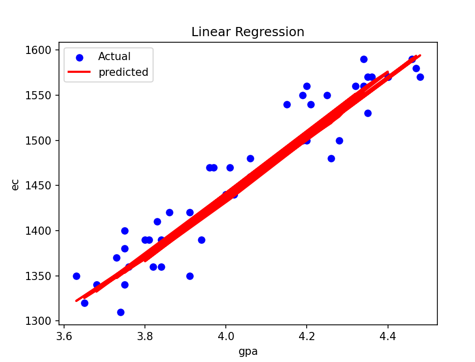

# CollegeAdmissionResultPredictor

<h3>-College admissions is a confusing process with so many factors to consider. 
-To help underclassmen strategize their highschool years, I analyzed what factors make a student successful in college admission.</h3>
<pre>
-Procedure:
  1.Data preprocessing:
    i)data
    -accessed school's internal database, chose 200+ alumni data points.
    -quantified the rigor of extracucciulars and leadership skills with a formula.

    -independent variables: sat score/act score, gpa, rigor of extracurriculars, leadership status
    -removed variables: legacy status, quality of essays/rec letters(confidential information)
    -dependent variable: admission status( accepted , waitlisted, rejected.)

  2. Statistical Analysis

  -Linear Regression:
  </img>
  </img>
  -Logistic Regression
  -RandomForest
  -DecisionTrees
  -ImportantFeatureAnalysis

   5. Issues / Potential Developments.
   <pre>
